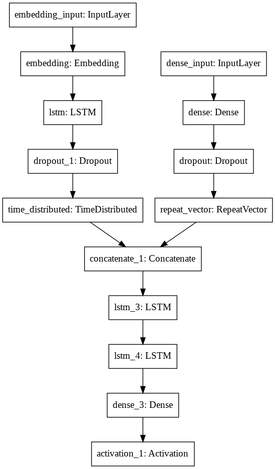
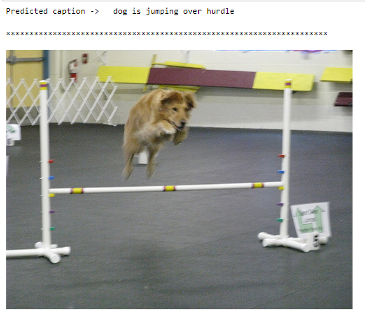

# Auto-image-captioning

This repository contains the code for Automatic captioning of images using NLP. First the images are converted to feature vectors using a pretrained resnet 50 model. AFter that an integrated model approach is used. First the feature vectors of images are downsampled and on the other side the captions are tokenised, padded and then a single block lstm model is used to create a feature vector. After this both the models are concatenated and a simple lstm structure is used to produce the sampled token. The whole already produced output is used to predict the next word since I am not using attention module.

Dataset: https://www.kaggle.com/shweta2407/flickr8k-imageswithcaptions

Scope of improvement:

- Using Attention module in language model
- Using Bidirectional LSTM

## Model:

## Result:

Made with :heart: by Bhuvan Aggarwal

